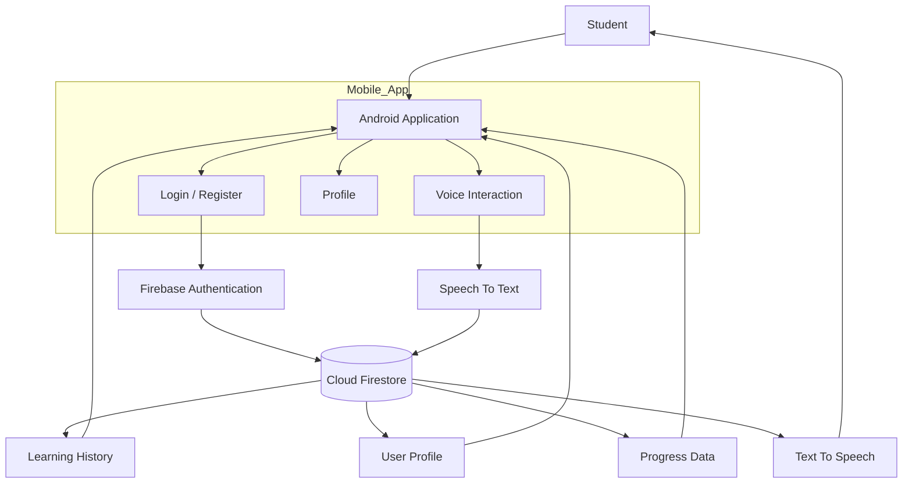
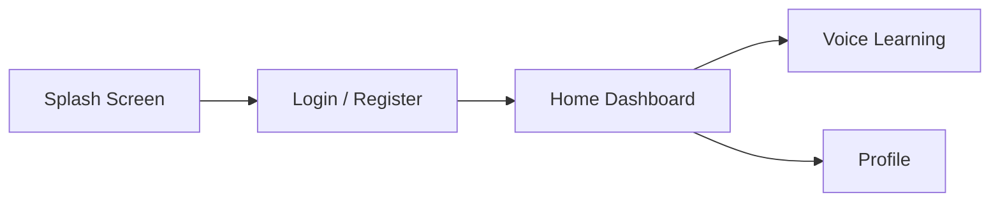

# 🎓 BOL SHIKSHA

<p align="center">
  
</p>

<p align="center">
  <b>Breaking Barriers of Learning Through Voice & Regional Languages</b>
</p>

<p align="center">
  
  
  
  
</p>

---

# 📖 Overview

**BOL SHIKSHA** is a multilingual educational platform developed for **Smart India Hackathon (SIH 2026)**. The application enables students to access quality education in regional languages using voice-based interaction, personalized learning, and secure cloud-based progress tracking.

---

# ✨ Features

- 🌐 Multilingual Learning Support
- 🎤 Speech-to-Text Learning
- 🔊 Text-to-Speech Responses
- 📚 Personalized Learning Content
- 🔐 Firebase Authentication
- ☁️ Cloud Firestore Database
- 📱 Modern Android UI (Jetpack Compose)

---

# 🛠 Tech Stack

| Technology | Usage |
|------------|------|
| Kotlin | Android Development |
| Android Studio | IDE |
| Jetpack Compose | UI Framework |
| Firebase Authentication | Login & Signup |
| Cloud Firestore | Database |
| Firebase Storage | Learning Resources |
| Git & GitHub | Version Control |

---

# 🏗 Complete System Architecture



---

# 🧩 Application Architecture

```text
                    BOL SHIKSHA

┌─────────────────────────────────────────────┐
│           Presentation Layer                │
│  • Jetpack Compose UI                      │
│  • Screens                                 │
│  • Navigation                              │
└─────────────────────────────────────────────┘
                    │
                    ▼
┌─────────────────────────────────────────────┐
│          Business Logic Layer              │
│  • Authentication                          │
│  • Voice Processing                        │
│  • User Management                         │
└─────────────────────────────────────────────┘
                    │
                    ▼
┌─────────────────────────────────────────────┐
│               Data Layer                   │
│  • Firebase Authentication                 │
│  • Cloud Firestore                         │
│  • Firebase Storage                        │
└─────────────────────────────────────────────┘
```

---

# 📂 Project Structure

```text
BOL-SHIKSHA/
│
├── app/
│   ├── src/
│   │   ├── main/
│   │   │   ├── java/
│   │   │   ├── res/
│   │   │   └── AndroidManifest.xml
│   │   ├── test/
│   │   └── androidTest/
│   │
│   ├── google-services.json
│   └── build.gradle
│
├── gradle/
│   └── wrapper/
│
├── build.gradle
├── settings.gradle
└── README.md
```

---

# 🔄 User Flow



---

# ☁️ Firebase Architecture

```text
                   Firebase

            Authentication
                   │
                   ▼
           User Verification
                   │
                   ▼
          Cloud Firestore
          ├── Users
          ├── Learning History
          └── Learning Progress
```

---

# 🚀 Installation

### 1. Clone Repository

```bash
git clone https://github.com/siddhu-codex/BOL-SHIKSHA.git
```

### 2. Open Project

1. Open **Android Studio**
2. Click **Open**
3. Select the **BOL-SHIKSHA** folder
4. Sync Gradle and Run

### 3. Firebase Setup

- Create a Firebase Project
- Enable **Authentication**
- Enable **Cloud Firestore**
- Download `google-services.json`
- Place it inside the `app/` folder

---

# 📱 Screenshots

| Home | Voice Learning |
|------|----------------|
| Add Screenshot | Add Screenshot |

| Profile | Progress |
|---------|----------|
| Add Screenshot | Add Screenshot |

---

# 🎯 SIH 2026

**Theme:** Smart Education

**BOL SHIKSHA** focuses on making education accessible through multilingual voice-enabled learning, secure user management, and cloud-based progress tracking for students across India.

---

# 👨‍💻 Team

**Team Name:** BOL SHIKSHA

| Member | Role |
|---------|------|
| Siddhraj Patil | Android Developer |
| Team Member | Firebase Developer |
| Team Member | UI/UX Designer |
| Team Member | Backend Developer |

---

# 🔮 Future Scope

- Offline Learning Mode
- OCR Text Recognition
- More Regional Languages
- Teacher Dashboard
- Student Progress Analytics

---

# 📄 License

This project was developed as a prototype for **Smart India Hackathon (SIH 2026)**.

---

## ⭐ Support

If you like this project, don't forget to **Star ⭐ the repository**.
